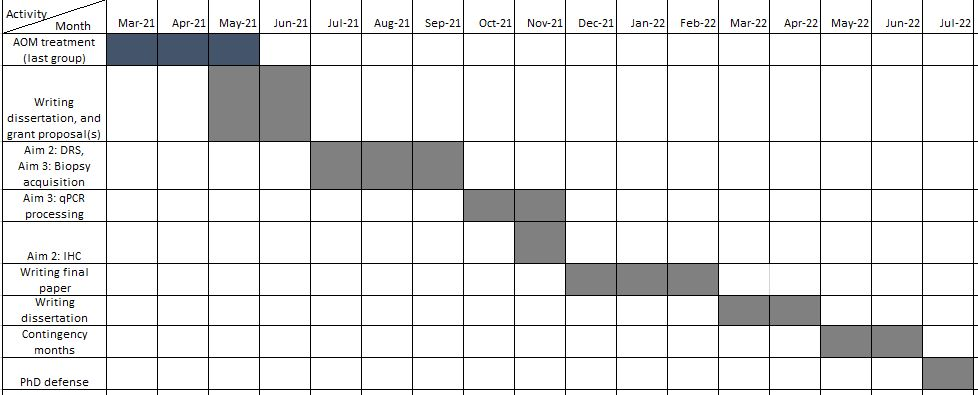

```{r setup, include=FALSE}
options(htmltools.dir.version = FALSE)
knitr::opts_chunk$set(
  fig.width=9, fig.height=3.5, fig.retina=3,
  out.width = "100%",
  cache = FALSE,
  echo = TRUE,
  message = FALSE, 
  warning = FALSE,
  fig.show = TRUE,
  hiline = TRUE
)
```

```{r xaringan-themer, include=FALSE, warning=FALSE}
library(xaringanthemer)
style_duo_accent(
  primary_color = "#1381B0",
  secondary_color = "#FF961C",
  inverse_header_color = "#FFFFFF"
)
```

## Typography

Text can be **bold**, _italic_, ~~strikethrough~~, or `inline code`.

[Link to another slide](#colors).

---
name: Academic credit status
class: top center

# Academic Credits Update

### BMEG Core: Completed

--

### BMEG Additional 6 hours: Completed

--

### General Electives: Missing 1 credit

--

### Life Sciences: Completed

--

### Engineering electives: Missing 2 credits

--

## I will take my final class in the Fall 

--

### BIOL 580V: Scientific Computing for Biologists


---

class: 

# Recap on Aims

## Aim 1

### Validate a sub-millimeter diffuse reflectance spectroscopy probe for endoscopic determination of perfusion

--

- This aim involved designing a miniature diffuse reflectance spectroscopy (DRS) 
  probe for endoscopic quantification of saturation ( $StO_2$), oxyhemoglobin ( $HbO_2$) and
  total hemoglobin ( $tHb$) in an azoxymethane model of colon cancer (CRC)
  
--

## Can we endoscopically use DRS  in  a mouse model?

--

## **Status: Completed**

---
class:

## Aim 2

### Longitudinally determine response to different NAC regimens in primary murine colorectal tumors and correlation with tissue biomarkers

--
### Using different chemotherapy regimens:

--
  - Maximum Tolerated Dose (MTD)
--
  - Metronomic (MET)
--
  - Control (saline)
--

## Do different treatment regimens change perfusion metrics in a primary CRC model? 

--

## Status: 75%

---
## Aim 2

### Final group of MTD mice to be completed by November. MET and CG groups are completed.


---
## Aim 3

### Determine the temporal correlation of DRS-derived perfusion markers and the expression of pro-angiogenic genes in different NAC regimens

--

- This aim tries to contextualize the results from Aim 2 with pro-angiogenic biomarkers
--

- Uses RT-qPCR to quantify relative mRNA expression

## Status: 65%

### - mRNA extraction and primers have been optimized

### - qPCR has been run for CG and MG samples

---
Updated timeline for PhD completion

.pull-left[
-  Remaining animal procedures to be completed by late September

- 2022 to be used mainly for writing final paper and dissertation

- Expected defense to take place by early July of 2022

]

.pull-right[

]